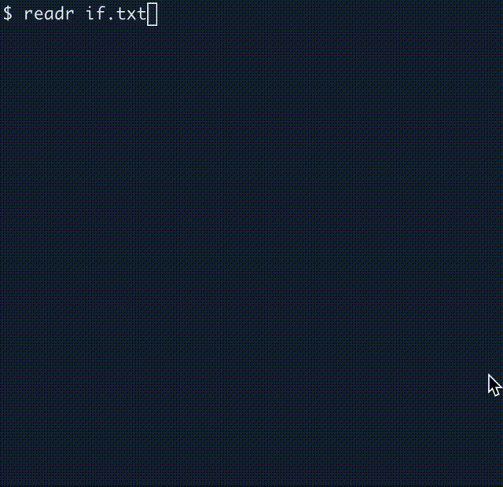

# File reader in async Rust

This program will print each character of input (from a file or STDIN) to the screen at a speed that will allow you to read along.
You can use the `-s|--slow` or `-f|--fast` flags to slow it down or speed it up.

```
Usage: readr [OPTIONS] <FILE>

Arguments:
  <FILE>  Input file or "-" for STDIN

Options:
  -s, --slow  Go slower
  -f, --fast  Go faster
  -h, --help  Print help
```

Here it is at normal speed:



I wrote this to explore `async` programming.

## Author

Ken Youens-Clark <kyclark@gmail.com>
